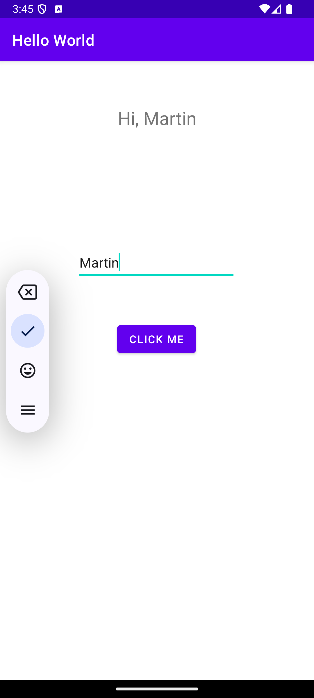

<h1>HelloWorldLab</h1>

This is a simple Android mobile application with a button and a text field.  
When the button "CLICK ME" is clicked, the text at the top is replaced with "Hi, {text}", {text} is the text from the text field. 

<h2>Instructions</h2>
1. Enter your name into the text field. 
2. Click the "CLICK ME" button to see the Android application greet.

<h2>Screenshot</h2>

